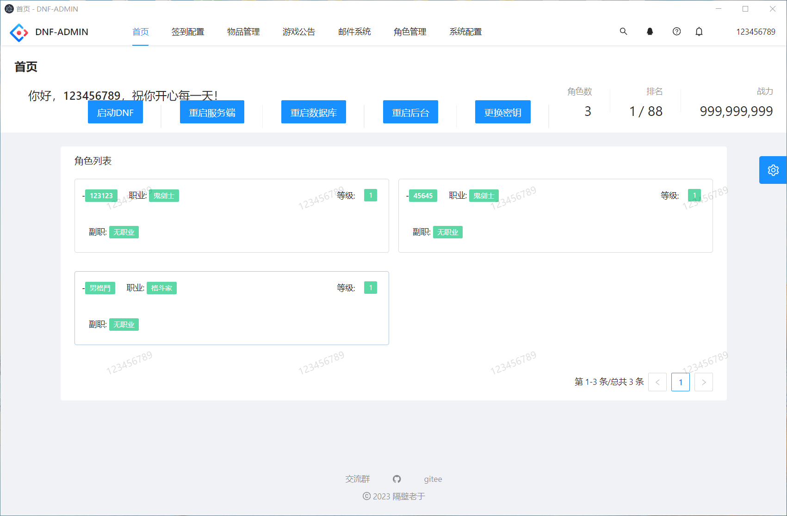
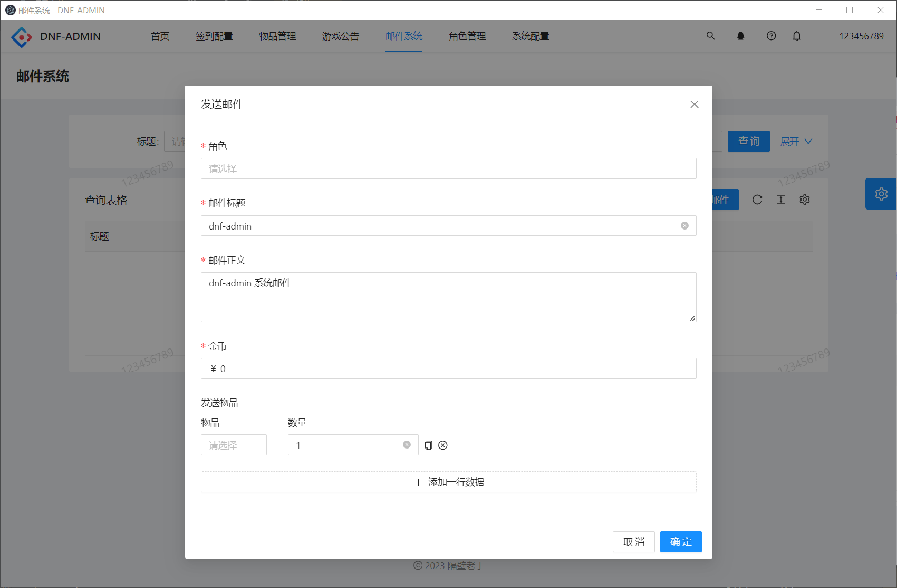

# dnf-admin

#### 介绍
- 某不可描述的勇士game后台，本项目为用爱发电，如果觉得不错欢迎分享给身边的朋友。
- 本项目致力于打造更便捷可动态配置游戏参数、拓展性更强的增强类后台，解决插件脚本配置麻烦，需要到处找教程，小白看了教程很蒙圈的情况，被倒卖者圈钱的情况，会逐步集成常用插件功能。
- 欢迎兴趣相投的朋友加入群组一起交流技术
- 2024.02.27 正式发布1.0.4版本,代码同步更新,新增OneBot功能支持,基于OneBotV11反向ws对接,具体请看下方演示图片。
- 目前已添加centos一键安装脚本，主要支持两种模式：1、完全模式(带服务端) 2.GM工具模式(可以独立运行,网页访问,不支持frida相关特性功能)
- 新增windows独立使用版，下载地址在release的网盘分享

#### 项目使用文档
http://doc.easydo.plus/

#### 本项目仅供学习交流，请于下载后的24小时内删除，不得用于商业牟利行为。

- 你们的支持是我更新的动力,如果觉得不错还请点个star，这对我很重要。
- 在线网页演示地址： https://da.easydo.plus/  账号：123456789 密码：123456789
- 最新视频教程： https://www.bilibili.com/video/BV1LN4y1B77b/
- gitee仓库：https://github.com/easy-do/dnf-admin
- github仓库 https://gitee.com/yuzhanfeng/dnf-admin
- 常用教程、游戏版本、其他工具：https://daf.ink/
- 吹水群1: 154213998  架设和使用遇到问题或意见反馈来此群
- 吹水群2（防失联）： https://im.easydo.plus/invite/l_7xH88A
- TG频道: https://t.me/+jg121NZWl51mZTQ9

#### 桌面端 & windows独立使用版 & 小白专用vm虚拟机一键端（集成dnf-admin）

度盘：https://pan.baidu.com/s/1OXWrKExtj3mNiUReGU_acg?pwd=skqc
123：
https://www.123pan.com/s/DUoAjv-JkRRA.html提取码:hqLE

#### 软件架构
- 服务端：spring boot
- 前端：ANTD PRO
- 插件：frida

#### 特色功能

- 使用docker容器运行,安装卸载方便,与宿主机隔离,减少垃圾文件污染
- 按钮级别的权限控制
- 支持frida在线调试、热更代码
- frida脚本的在线编辑、方便拆分和组合函数
- 不间断的长期更新支持、免费试用、代码开源、无后门

#### 图片介绍

#### 作者自实现的bot功能

#### 更新记录&支持功能
- 使用游戏账号密码登录,支持注册账号
- 按钮级别的权限动态配置
- 支持每日签到配置，可指定特定日期的签到标题，奖励内容（物品无上限，可无限添加），登录游戏角色自动签到发送邮件。
- 支持发送游戏公告
- 支持发送邮件,无需小退 (依赖frida)
- 支持后台配置游戏相关脚本功能并实时生效 (依赖frida)
- 支持导入pvfUtility提取的装备和道具压缩包(必须是标准导出)-2023.11.11
- 支持设置等级上限-2023.11.11 (依赖frida)
- 支持绝望之塔通关后仍可继续挑战-2023.11.11 (依赖frida)
- 支持设置物品免确认-2023.11.11 (依赖frida)
- 支持允许创建缔造者-2023.11.11 (依赖frida)
- 支持开启GM功能-2023.11.11 (依赖frida)
- 支持关闭新账号发送的契约邮件-2023.11.11 (依赖frida)
- 修复绝望之塔金币异常-2023.11.11 (依赖frida)
- 支持读取pvf文件自动导入物品数据-2023.11.12
- 支持系统页面重构、支持桌面端-2023.11.25
- 支持角色管理、菜单授权-2023.11.25
- 支持重启后台、数据库、服务端-2023.11.25 (docker完全版)
- 支持自动生成和替换密钥-2023.11.25  (docker完全版)
- 支持注册账号-2023.11.25
- 支持一键登录,免去集成其他登陆器-2023.11.25 (docker完全版)
- 修复dp插件复制逻辑错误-2023.11.26
- 修复pvf物品读取错误-2023.11.26
- 添加账号管理-2023.12.01
- 支持账户封禁、解封、重置密码、充值点券-2023.12.01
- 移除dp2，全面拥抱frida-2023-12-17
- 添加frida函数管理-2023-12-17 
- 添加frida脚本管理-2023-12-17
- 添加频道管理-2023-12-17 (docker完全版)
- 添加frida调试-2023-12-17 (docker完全版)
- 所有角色开启GM功能-2023-12-17 (依赖frida)
- 关闭新账号发送的契约邮件-2023-12-17 (依赖frida)
- 解除角色创建限制-2023-12-17 (依赖frida)
- 赛利亚房间互相可见-2023-12-17 (依赖frida)
- 关闭副本门口禁止摆摊-2023-12-17 (依赖frida)
- 魔法封印自动解封-2023-12-17 (依赖frida)
- 开启深渊模式-2023-12-17 (依赖frida)
- +13以上强化券无需小退-2023-12-17 (依赖frida)
- 角色登录是否发送欢迎词-2023-12-17 (依赖frida)
- 角色登录的欢迎词内容-2023-12-17 (依赖frida)
- 角色登录是否发送频道公告-2023-12-17 (依赖frida)
- 角色登录发送的公告内容-2023-12-17 (依赖frida)
- 角色退出是否发送频道公告-2023-12-17 (依赖frida)
- 角色退出发送的公告内容-2023-12-17 (依赖frida)
- 深渊强制非常困难-2023-12-17 (依赖frida)
- 客户端临时提升技能等级-2023-12-17 (依赖frida)
- 副本拾取播报-2023-12-17 (依赖frida)
- 副本拾取播报内容-2023-12-17 (依赖frida)
- 副本拾取奖励点券数量-2023-12-17 (依赖frida)
- 触发副本拾取播报的物品稀有度-2023-12-17 (依赖frida)
- 完成所有任务道具-2023-12-19 (依赖frida)
- 完成指定任务道具-2023-12-19 (依赖frida)
- 配置要完成的指定任务-2023-12-19 (依赖frida)
- 已接任务完成道具-2023-12-19 (依赖frida)
- 装备继承道具-2023-12-19 (依赖frida)
- 装备跨界道具-2023-12-19 (依赖frida)
- 装备分解道具-2023-12-19 (依赖frida)
- 魔法封印重置道具-2023-12-19 (依赖frida)
- 称号合成道具-2023-12-19 (依赖frida)
- 初阶异界重置道具-2023-12-19 (依赖frida)
- 高级异界重置道具-2023-12-19 (依赖frida)
- 优化frida脚本分页查询速度-2023-12-21
- 增加角色管理-2023-12-29
- 增加角色装备背包预览-2023-12-29
- 增加角色装备背包编辑(初步完成) -2023-12-29
- 修复桌面端报错和角色分页报错 -2023-12-30
- 优化页面加载速度 -2023-12-30
- 添加CDK管理和兑换 -2024-01-05
- 增加验证码校验 -2024-01-06
- 相关功能代码的优化 -2024-01-07
- 账号管理增加重置角色创建次数 -2024-01-07
- 账号管理增加设置角色栏最大 -2024-01-07
- 角色管理增加开启左右槽 -2024-01-07
- 封禁账户禁止登录后台 -2024-01-09
- 添加license功能(非收费操作,只是为了后续防倒卖) -2024-01-14
- 添加在线数量统计 -2024-01-23
- 支持查询在线角色 -2024-01-24
- 添加清空邮件功能 -2024-01-29
- 数据库备份(50%,功能放到哪里还在设计中) -2024-01-29 （弃坑）
- 添加账号全图王者 -2024-01-31
- 角色支持清空背包、装备、时装和宠物栏 -2024-01-31
- 角色支持修改pvp段位、胜点、胜场 -2024-01-31
- 账号和角色管理页操作栏优化 -2024-01-31 
- 角色物品编辑功能体验优化 -2024-02-01
- 支持角色时装删除和清空 -2024-02-01
- 支持角色宠物栏编辑和清空 -2024-02-01
- 支持角色仓库编辑和清空 -2024-02-01
- 支持修改角色金币SP、TP、QP、时装币 -2024-02-01
- 支持账号金库管理 (开通、删除、编辑物品、修改金库格子和金币) -2024-02-02
- 支持游戏事件查看,可以分析账号角色行为  -2024-02-02
- 发布桌面独立使用版本  -2024-02-20
- 机器人功能（50%）,下个大版本更新 - 2024-02-24
- 移除服务端的统一网关 -2024-02-24
- 添加一键安装脚本 -2024-02-24
- 机器人管理和通信框架初步完成 - 2024-02-27
- 机器人相关api文档 - 筹备中

#### 参与贡献

1.  Fork 本仓库
2.  新建  分支
3.  提交代码
4.  新建 Pull Request

#### 反馈相关
1.  在仓库提交is
2.  在群内找我反馈
3.  提供使用的frida功能代码，我来集成实现

