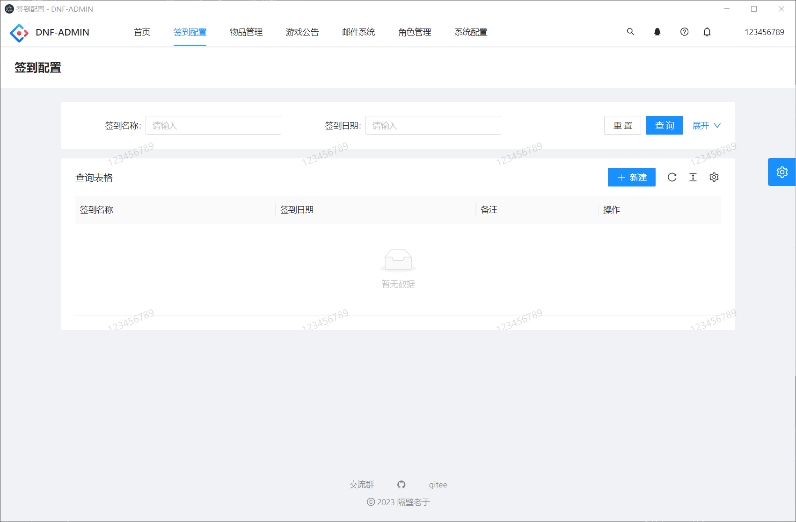
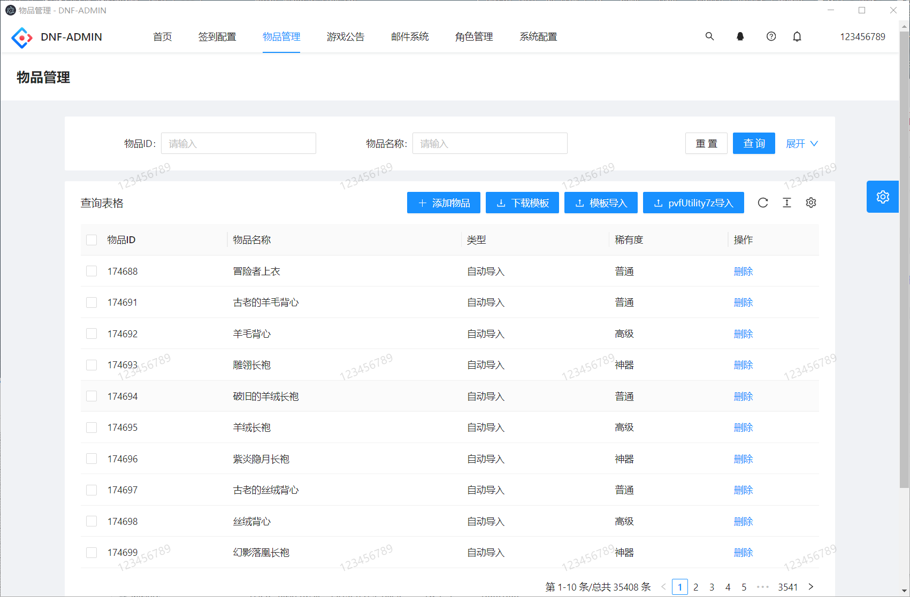

# dnf-admin

#### 介绍
某不可描述的勇士game后台，本项目为用爱发电，如果觉得不错欢迎分享给身边的朋友。
本项目致力于打造更便捷可动态配置游戏参数、拓展性更强的游戏增强类后台，解决dp插件配置麻烦，需要到处找教程，小白看了教程很蒙圈的情况，逐步集成常用插件功能。
本项目无二开限制，商用还请注明出处。
欢迎感兴趣的同学加入贡献代码，本项目保证一直开源，不会进行停更、闭源收费等操作，但不保证以后不会加入广告，哈哈，毕竟为爱发电。

- 你们的支持是我更新的动力,看着越来越多的同学开始使用我感觉更有更新动力，如果觉得不错还请点个star，这对我很重要。

- https://github.com/easy-do/dnf-admin
- https://gitee.com/yuzhanfeng/dnf-admin
- 常用教程、游戏版本、相关工具：https://www.dafschool.site/


- 演示视频: https://www.bilibili.com/video/BV1UH4y1r7Z8/
- 老版部署教程: https://www.bilibili.com/video/BV1ju4y187SS/
- 技术交流： https://im.easydo.plus/invite/l_7xH88A

- 1.0.2版本现已发布，推荐升级体验
- 演示地址： https://da.easydo.plus/


#### 软件架构
- 服务端：spring boot + mybatisflex + sa-token
- 前端：ANTD PRO
- dp插件：2.8.2集成frida通信

#### 特色功能
首次在java语言上(可能是首次)变向实现了后台与dp和frida的通信能力，支持调用脚本函数，接受游戏事件并做出对应处理，为实现各种功能提供了更多可能，欢迎对lua和frida有丰富使用经验的大佬来指点wensocket通信方式的实现，目前的实现方式为http轮询。

#### 图片介绍






#### 更新记录&支持功能
- 使用游戏账号密码登录
- 对指定功能进行权限控制，目前仅区分普通用户和超级管理员，后期添加所有功能权限动态配置(可以配置指定账号的权限)
- 角色登录进行回调记录
- 支持每日签到配置，可指定特定日期的签到标题，奖励内容（物品无上线，可无限添加），玩家可在网页端签到，登录游戏角色自动签到，方便打卡。
- 支持发送游戏公告
- 支持发送邮件,无需小退
- 支持后台配置游戏相关脚本功能并实时生效
- 支持配置一键完成主线任务的道具
- 支持配置指定强化增幅指定等级不失败
- 支持导入pvfUtility提取的装备和道具压缩包(必须是标准导出)-2023.11.11
- 支持设置等级上限-2023.11.11
- 支持绝望之塔通关后仍可继续挑战-2023.11.11
- 支持设置物品免确认-2023.11.11
- 支持解除100级及以上的限制-2023.11.11
- 支持退出副本免虚弱-2023.11.11
- 支持解锁镇魂开门任务-2023.11.11
- 支持允许创建缔造者-2023.11.11
- 支持开启GM功能-2023.11.11
- 支持关闭新账号发送的契约邮件-2023.11.11
- 支持解除交易限额效-2023.11.11
- 支持设置使用拍卖行的最低等级-2023.11.11
- 支持修复拍卖行消耗品上架-2023.11.11
- 支持关闭NPC回购系统-2023.11.11
- 支持禁用支援兵-2023.11.11
- 支持禁用道具掉落随机强化-2023.11.11
- 支持装备解锁时间-2023.11.11
- 支持掉落时随机赋予红字的装备最低等级-2023.11.11
- 修复绝望之塔金币异常-2023.11.11
- 支持读取pvf文件自动导入物品数据-2023.11.12
- 支持系统页面重构、支持桌面端-2023.11.25
- 支持角色管理、菜单授权-2023.11.25
- 支持重启后台、数据库、服务端-2023.11.25
- 支持自动生成和替换密钥-2023.11.25
- 支持注册账号-2023.11.25
- 支持一键登录,免去集成其他登陆器-2023.11.25
- 修复dp插件复制逻辑错误-2023.11.26
- 修复pvf物品读取错误-2023.11.26
- 添加账号管理-2023.12.01
- 支持账户封禁、解封、重置密码、充值点券-2023.12.01
- 
#### docker服务端加后台一键部署教程

- 视频教程：
  其他说明.txt

- 整体流程为下载 docker-compose.yaml  编辑环境变量、启动容器编排

- 克隆代码 如果服务器没有git需要安装一下，以centos为例
```shell
yum install git -y
```
- 克隆命令
```shell
cd /root
git clone https://gitee.com/yuzhanfeng/dnf-admin.git  
cd dnf-admin
```
- 安装docker,服务器已经安装了直接跳过
```shell
yum install docker -y
```
- 安装docker-compose,服务器已经安装了直接跳过
```shell
yum install docker-compose -y
```

- 编辑 docker-compose.yaml的内容，配置环境变量，哪些需要改看注释

```yaml
# 请修改这里的环境变量
x-env: &env
  environment:
    - TZ=Asia/Shanghai
    # game账户ip白名单 默认即可
    - ALLOW_IP=172.20.0.%
    # game账户密码 默认即可
    - GAME_PASSWORD=uu5!^%jg
    # root账户密码 外网则需要修改
    - MYSQL_ROOT_PASSWORD=88888888
    - MYSQL_PASS=88888888
    # 自动获取mysql容器的ip 默认即可
    - AUTO_MYSQL_IP=true
    # mysql容器名称 默认即可
    - MYSQL_NAME=dnfmysql
    # mysql的IP地址 默认即可
    - MYSQL_IP=dnfmysql
    # 自动获取公网ip 推荐false 手动填写服务器ip
    - AUTO_PUBLIC_IP=false
    # 这里填写你的服务器公网或局域网IP地址 
    - PUBLIC_IP=192.168.123.88
    # 以下是统一登录器相关配置
    # 网关的登录账号
    - GM_ACCOUNT=gm_user
    # 网关的登录密码
    - GM_PASSWORD=123456
    # 网关的通信密钥
    - GM_CONNECT_KEY=763WXRBW3PFTC3IXPFWH
    # 网关的登录器版本
    - GM_LANDER_VERSION=20180307
    # 以下是后台dnf-admin的相关配置
    # 拥有管理员权限的游戏账号
    - ADMIN_USER=123456789
    # dp插件的通信密钥 非外网默认即可，因为还需要同步修改服务端的/dp2/lua/reportDp.lua
    - DP_GM_KEY=123456789
    # 服务端读取pvf文件的路径、docker端编排方式保持默认值即可
    - PVF_PATH=/data/server/data/Script.pvf

```
- 启动数据库
```shell
docker-compose up -d dnfmysql
```
查看数据库日志,使用相关工具连接数据库，因为首次加载比较慢，需要确保数据库初始化完成在继续启动其他服务才能启动服务端和后台

```shell
docker logs -f dnfmysql  
```
- 数据库初始化完成后启动后台

```shell
docker-compose up -d dnfadmin
```

- 查看后台日志
```shell
docker logs -f dnfadmin 
```
当日志里面出现 "Completed initialization in 1 ms" 字样则代表正常启动完成,初次启动会加载pvf文件并导入数据库
,如果看到 INSERT INTO `da_item`(`id`, `name`, `type`, `rarity`) VALUES 这样的日志则代表正在导入数据库,可以不用管，往下走启动服务端

- 启动服务端

```shell
docker-compose up -d dnfserver
```
- 查看服务端日志
```shell
docker logs -f dnfserver
```
一般看到"server has been started successfully."字样停留不动，并且cpu占用骤降就代表服务端基本启动完成，再过一阵还能看到五国字样

- 服务端的详细日志日志一般存放在 /data/dnf/server/log下, 可以使用命令tail -f查看详细日志 
```shell
tail -f 这里换成具体日志的位置 比如 /data/dnf/server/log/siroco11/Logxxxxxx.log
```
- 数据库文件存在 /data/dnf/mysql,如果需要删档或或者初始化数据库长时间不成功就删掉这个目录下的所有文件，然后重启数据库服务

- 后台地址

```yaml
http://ip:8888 # 请使用游戏注册的账号密码登录，管理员为第一步环境变量内配置的超级管理员账号，其他游戏账号夜客登录权限为普通用户
```

- pvf及等级补丁替换路径

```shell
/data/dnf/server/data
```

- 1.0版本升级到1.1最新版后台:

```shell
cd /root/dnf-admin
# 编辑docker-compose.yaml，一般在第59行 将registry.cn-hangzhou.aliyuncs.com/gebilaoyu/dnf-admin:1.0.0 修改为 registry.cn-hangzhou.aliyuncs.com/gebilaoyu/dnf-admin:1.0.1
docker pull registry.cn-hangzhou.aliyuncs.com/gebilaoyu/dnf-admin:1.0.2
docker rm -f dnfadmin
docker-compose up -d dnfadmin
docker restart dnfserver
```

- 升级当前版本后台到最新版:

```shell
cd /root/dnf-admin
docker-compose pull 
docker rm -f dnfadmin
docker-compose up -d dnfadmin
docker restart dnfserver
```

- 卸载所有数据，彻底清除
```shell
cd /root/dnf-admin
docker-compose stop
docker-compose rm -f
rm -rf /data/dnf/*
docker rmi registry.cn-hangzhou.aliyuncs.com/gebilaoyu/dnfmysql:5.6
docker rmi registry.cn-hangzhou.aliyuncs.com/gebilaoyu/dnf-admin:1.0.2
docker rmi registry.cn-hangzhou.aliyuncs.com/gebilaoyu/dnfserver:latest
```

#### 其他说明

- 后台镜像目前支持的环境变量
``` yaml
MYSQL_HOST #游戏数据库ip 默认 dnfmysql
MYSQL_PORT #游戏数据库端口 默认 3306
MYSQL_PASS 3游戏数据库密码 默认 88888888
ADMIN_USER 3超级管理员对应的游戏账号 默认123456789
DP_GM_KEY #与dp插件通信的安全密钥 默认123456789 
```
- 后台端口默认为 8888 使用游戏的账号密码登录
- 其他教程待补充


#### 独立部署简易教程

- 此教程针对已经部署服务端，集成或未集成dp插件的情况下需要单独使用网页GM工具的场景

- 下载项目文件或git克隆仓库
  仓库地址：https://gitee.com/yuzhanfeng/dnf-admin
- 克隆代码 如果服务器git需要安装一下，以centos为例
```shell
yum install git -y
```
- 克隆命令
```shell
cd /root
git clone https://gitee.com/yuzhanfeng/dnf-admin.git  
cd dnf-admin
```
- 安装docker,服务器已经安装了直接跳过
```shell
yum install docker -y
```

- 将dp2插件的全部文件复制到服务器/dp2目录内

```shell
cp -r /root/dnf-admin/dp2/* /dp2
```

- 如果未集成dp2插件则需要修改run文件  在启动频道代码前添加 LD_PRELOAD="=/dp2/libdp2pre.so"
  例如：
```yaml
LD_PRELOAD=/dp2/libdp2pre.so ./df_game_r siroco11 start &
sleep 2
LD_PRELOAD=/lib/libdp2pre.so ./df_game_r siroco52 start &
```
- 如果已经集成了dp2只要确认正确替换了原dp插件目录下的所有文件就行无需特殊修改
- 
- 修改/dp2/lua/dpReport.lua的相关参数

``` yaml
    -- gmKey:为了通讯安全请与服务端同步设置复杂的密钥
    local gmKey = "123456789"
    --改为dnf-admin的ip和端口，如果你的服务端跑在宿主机，后台也在同一台服务器上则改为http://127.0.0.1:8888,注意：8888这个端口代表的是后面启动后台时指定的端口
    local adminAddr = "http://dnf-admin:8888"

```
- 以上操作完成后先不要重启服务端。

- 运行GM网页后台程序 注意替换启动命令的环境变量，把文字描述的替换掉对应参数
- docker run -dit  -e MYSQL_HOST=你的数据库ip  -e MYSQL_PORT=数据库端口 -e MYSQL_USER=数据库账号 -e MYSQL_PASS=数据库密码 -e ADMIN_USER=超级管理员游戏账号(游戏的账号) -e DP_GM_KEY=与后台的通讯密钥 -p 后台的端口号:8888 --name dnf-admin registry.cn-hangzhou.aliyuncs.com/gebilaoyu/dnf-admin:1.0.0
- 例如:
```shell 
docker pull registry.cn-hangzhou.aliyuncs.com/gebilaoyu/dnf-admin:1.0.2
docker run -dit  -e MYSQL_HOST=127.0.0.1  -e MYSQL_PORT=3306 -e MYSQL_USER=game -e MYSQL_PASS=uu5!^%jg -e ADMIN_USER=123456789 -e DP_GM_KEY=123456789 -p 8888:8888 --name dnfadmin registry.cn-hangzhou.aliyuncs.com/gebilaoyu/dnf-admin:1.0.2
```

- 查看后台日志

```shell
docker logs -f dnfadmin
```

- 访问后台
```yaml
http://服务器ip:8888     使用游戏的账号密码登录，超管权限账号是环境变量ADMIN_USER设置的账号，其他账号为普通权限
```

- 升级后台
```shell
docker pull registry.cn-hangzhou.aliyuncs.com/gebilaoyu/dnf-admin:1.0.2
docker rm -f dnfadmin
# 这里在执行一遍你之前的启动命令
```
- 重启后台
```shell
docker restart dnfadmin
```
- 卸载后台
```shell
docker rm -f dnfadmin
docker rmi registry.cn-hangzhou.aliyuncs.com/gebilaoyu/dnf-admin:1.0.2
```

#### 参与贡献

1.  Fork 本仓库
2.  新建  分支
3.  提交代码
4.  新建 Pull Request

#### 反馈相关
1.  在仓库提交is
2.  在群内找我反馈
3.  提供使用的dp功能代码，我来集成实现

