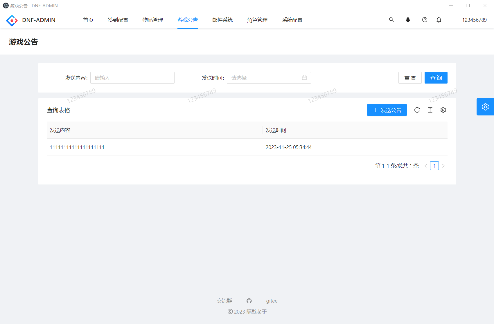
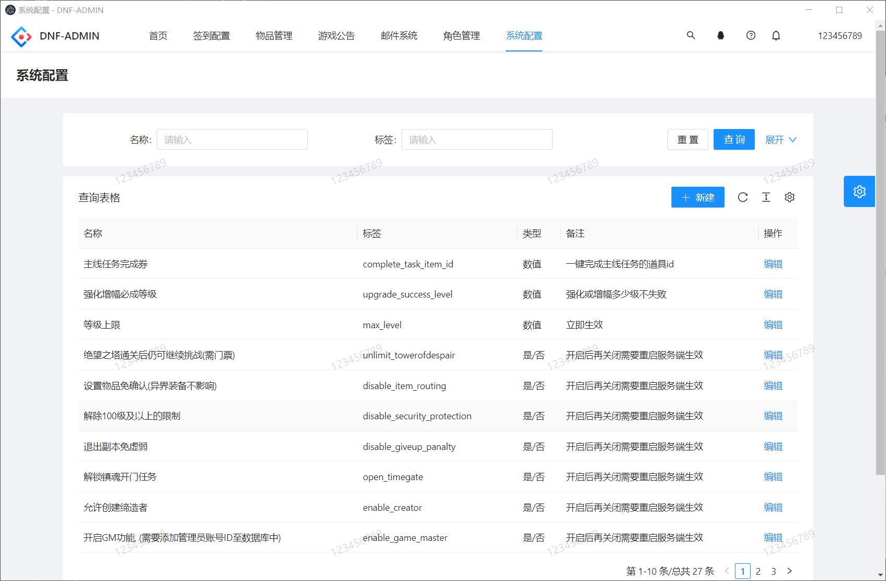

# dnf-admin

#### 介绍
- 某不可描述的勇士game后台，本项目为用爱发电，如果觉得不错欢迎分享给身边的朋友。
- 本项目致力于打造更便捷可动态配置游戏参数、拓展性更强的增强类后台，解决插件脚本配置麻烦，需要到处找教程，小白看了教程很蒙圈的情况，被倒卖者圈钱的情况，会逐步集成常用插件功能。
- 欢迎兴趣相投的朋友加入群组一起交流技术
- 2023.12.17 正式发布1.0.3版本,全面支持frida动态通信,从本版本开始将全面移除dp2相关功能，使用frida-server注入,感谢【菜逗逗】同学提供的思路和示例代码。


#### 本项目仅供学习交流，请于下载后的24小时内删除，不得用于商业牟利行为。


- 你们的支持是我更新的动力,如果觉得不错还请点个star，这对我很重要。

- 1.0.3版本现已正式发布，正式移除dp2插件,如果对dp插件依赖较高升级请慎重，相关功能支持变更请查看下方的更新记录&支持功能！！！！！！！！！
- 在线网页演示地址： https://da.easydo.plus/
- 最新视频教程： https://www.bilibili.com/video/BV1LN4y1B77b/
- gitee仓库：https://github.com/easy-do/dnf-admin
- github仓库 https://gitee.com/yuzhanfeng/dnf-admin
- 常用教程、游戏版本、其他工具：https://daf.ink/
- 吹水群1: 154213998  架设和使用遇到问题或意见反馈来此群
- 吹水群2（防失联）： https://im.easydo.plus/invite/l_7xH88A

#### 桌面端 & 小白专用vm虚拟机一键端

度盘：https://pan.baidu.com/s/1OXWrKExtj3mNiUReGU_acg?pwd=skqc
123：
https://www.123pan.com/s/DUoAjv-JkRRA.html提取码:hqLE

#### 软件架构
- 服务端：spring boot
- 前端：ANTD PRO
- 插件：frida

#### 特色功能

- 使用docker容器运行,安装卸载方便,与宿主机隔离,减少垃圾文件污染
- 按钮级别的权限控制
- 支持frida在线调试、热更代码
- frida脚本的在线编辑、方便拆分和组合函数
- 不间断的长期更新支持、免费试用、代码开源、无后门


#### 图片介绍







#### 更新记录&支持功能
- 使用游戏账号密码登录,支持注册账号
- 按钮级别的权限动态配置
- 支持每日签到配置，可指定特定日期的签到标题，奖励内容（物品无上线，可无限添加），登录游戏角色自动签到发送邮件。
- 支持发送游戏公告
- 支持发送邮件,无需小退
- 支持后台配置游戏相关脚本功能并实时生效
- ~~支持配置一键完成主线任务的道具(下个小版本添加)~~
- ~~支持配置指定强化增幅指定等级不失败~~
- ~~支持退出副本免虚弱-2023.11.11~~
- ~~支持解锁镇魂开门任务-2023.11.11~~
- ~~支持解除100级及以上的限制-2023.11.11~~
- ~~支持解除交易限额效-2023.11.11~~
- ~~支持设置使用拍卖行的最低等级-2023.11.11~~
- ~~支持修复拍卖行消耗品上架-2023.11.11~~
- ~~支持关闭NPC回购系统-2023.11.11~~
- ~~支持禁用支援兵-2023.11.11~~
- ~~支持禁用道具掉落随机强化-2023.11.11~~
- ~~支持装备解锁时间-2023.11.11~~
- ~~支持掉落时随机赋予红字的装备最低等级-2023.11.11~~
- 支持导入pvfUtility提取的装备和道具压缩包(必须是标准导出)-2023.11.11
- 支持设置等级上限-2023.11.11
- 支持绝望之塔通关后仍可继续挑战-2023.11.11
- 支持设置物品免确认-2023.11.11
- 支持允许创建缔造者-2023.11.11
- 支持开启GM功能-2023.11.11
- 支持关闭新账号发送的契约邮件-2023.11.11
- 修复绝望之塔金币异常-2023.11.11
- 支持读取pvf文件自动导入物品数据-2023.11.12
- 支持系统页面重构、支持桌面端-2023.11.25
- 支持角色管理、菜单授权-2023.11.25
- 支持重启后台、数据库、服务端-2023.11.25
- 支持自动生成和替换密钥-2023.11.25
- 支持注册账号-2023.11.25
- 支持一键登录,免去集成其他登陆器-2023.11.25
- 修复dp插件复制逻辑错误-2023.11.26
- 修复pvf物品读取错误-2023.11.26
- 添加账号管理-2023.12.01
- 支持账户封禁、解封、重置密码、充值点券-2023.12.01
- 移除dp2，全面拥抱frida-2023-12-17
- 添加frida函数管理-2023-12-17
- 添加frida脚本管理-2023-12-17
- 添加频道管理-2023-12-17
- 添加frida调试-2023-12-17
- 所有角色开启GM功能-2023-12-17
- 关闭新账号发送的契约邮件-2023-12-17
- 解除角色创建限制-2023-12-17
- 赛利亚房间互相可见-2023-12-17
- 关闭副本门口禁止摆摊-2023-12-17
- 魔法封印自动解封-2023-12-17
- 开启深渊模式-2023-12-17
- +13以上强化券无需小退-2023-12-17
- 角色登录是否发送欢迎词-2023-12-17
- 角色登录的欢迎词内容-2023-12-17
- 角色登录是否发送频道公告-2023-12-17
- 角色登录发送的公告内容-2023-12-17
- 角色退出是否发送频道公告-2023-12-17
- 角色退出发送的公告内容-2023-12-17
- 深渊强制非常困难-2023-12-17
- 客户端临时提升技能等级-2023-12-17
- 副本拾取播报-2023-12-17
- 副本拾取播报内容-2023-12-17
- 副本拾取奖励点券数量-2023-12-17
- 触发副本拾取播报的物品稀有度-2023-12-17
- 完成所有任务道具-2023-12-19
- 完成指定任务道具-2023-12-19
- 配置要完成的指定任务-2023-12-19
- 已接任务完成道具-2023-12-19
- 装备继承道具-2023-12-19
- 装备跨界道具-2023-12-19
- 装备分解道具-2023-12-19
- 魔法封印重置道具-2023-12-19
- 称号合成道具-2023-12-19
- 初阶异界重置道具-2023-12-19
- 高级异界重置道具-2023-12-19
- 优化frida脚本分页查询速度-2023-12-21
- 增加角色管理-2023-12-29
- 增加角色装备背包预览-2023-12-29
- 增加角色装备背包编辑(初步完成) -2023-12-29
- 修复桌面端报错和角色分页报错 -2023-12-30
- 优化页面加载速度 -2023-12-30
- 添加CDK管理和兑换 -2024-01-05
- 增加验证码校验 -2024-01-06
- 相关功能代码的优化 -2024-01-07
- 账号管理增加重置角色创建次数 -2024-01-07
- 账号管理增加设置角色栏最大 -2024-01-07
- 角色管理增加开启左右槽 -2024-01-07
- 封禁账户禁止登录后台 -2024-01-09
- 添加license功能(非收费操作,只是为了后续防倒卖) -2024-01-14
- 添加在线数量统计 -2024-01-23
- 支持查询在线角色 -2024-01-24
- 添加清空邮件功能 -2024-01-29
- 数据库备份(50%,功能放到哪里还在设计中) -2024-01-29
- 添加账号全图王者 -2024-01-31
- 角色支持清空背包、装备、时装和宠物栏 -2024-01-31
- 角色支持修改pvp段位、胜点、胜场 -2024-01-31
- 账号和角色管理页操作栏优化 -2024-01-31 
- 角色物品编辑功能体验优化 -2024-02-01
- 支持角色时装删除和清空 -2024-02-01
- 支持角色宠物栏编辑和清空 -2024-02-01
- 支持角色仓库编辑和清空 -2024-02-01
- 支持修改角色金币SP、TP、QP、时装币 -2024-02-01
- 支持账号金库管理 (开通、删除、编辑物品、修改金库格子和金币) -2024-02-02
- 支持游戏事件查看,可以分析账号角色行为  -2024-02-02
- 没有意外这应该是年前最后一次大更
- 

#### docker服务端加后台一键部署教程

- 服务端的最佳兼容系统版本为centos7 x86系统,debian系统测试正常，其他系统内核是否兼容未知
- 所有服务都是使用docker容器云行
- 整体流程为下载 docker-compose.yaml  编辑环境变量、启动容器编排

- 下载编排文件
```shell
yum install wget -y
mkdir /root/dnf-admin
cd /root/dnf-admin
wget https://gitee.com/yuzhanfeng/dnf-admin/releases/download/1.0.3/docker-compose.yaml
```

- 安装 docker和docker-compose,如果服务器已经安装则直接跳过

推荐安装1panel面板,会自动安装docker,否则自行百度自己系统如何安装docker

- 编辑 docker-compose.yaml的内容，配置环境变量，哪些需要改看注释

```yaml
# 请修改这里的环境变量
x-env: &env
  environment:
    - TZ=Asia/Shanghai
    # game账户ip白名单 默认即可
    - ALLOW_IP=172.20.0.%
    # game账户密码 默认即可
    - GAME_PASSWORD=uu5!^%jg
    # root账户密码 外网则需要修改
    - MYSQL_ROOT_PASSWORD=88888888
    - MYSQL_PASS=88888888
    # 自动获取mysql容器的ip 默认即可
    - AUTO_MYSQL_IP=true
    # mysql容器名称 默认即可
    - MYSQL_NAME=dnfmysql
    # mysql的IP地址 默认即可
    - MYSQL_IP=dnfmysql
    # 自动获取公网ip 推荐false 手动填写服务器ip
    - AUTO_PUBLIC_IP=false
    # 这里填写你的服务器公网或局域网IP地址 
    - PUBLIC_IP=192.168.123.88
    # 以下是统一登录器相关配置
    # 网关的登录账号
    - GM_ACCOUNT=gm_user
    # 网关的登录密码
    - GM_PASSWORD=123456
    # 网关的通信密钥
    - GM_CONNECT_KEY=763WXRBW3PFTC3IXPFWH
    # 网关的登录器版本
    - GM_LANDER_VERSION=20180307
    # 以下是后台dnf-admin的相关配置
    # 拥有管理员权限的游戏账号
    - ADMIN_USER=123456789
    # 服务端读取pvf文件的路径、docker端编排方式保持默认值即可
    - PVF_PATH=/data/server/data/Script.pvf

```

- 拉取镜像
```shell
docker pull registry.cn-hangzhou.aliyuncs.com/gebilaoyu/frida-client:latest
docker-compose pull
```

- 启动数据库
```shell
docker-compose up -d dnfmysql
```
查看数据库日志,使用相关工具连接数据库，因为首次加载比较慢，需要确保数据库初始化完成在继续启动其他服务才能启动服务端和后台

```shell
docker logs -f dnfmysql  
```
- 数据库初始化完成后启动服务端

```shell
docker-compose up -d dnfserver
```
- 查看服务端日志
```shell
docker logs -f dnfserver
```

- 启动dnfadmin

```shell
docker-compose up -d dnfadmin
```
当日志里面出现 "Completed initialization in 1 ms" 字样则代表正常启动完成,初次启动会加载pvf文件并导入数据库
,如果看到 INSERT INTO `da_item`(`id`, `name`, `type`, `rarity`) VALUES 这样的日志则代表正在导入数据库,可以不用管，往下走启动服务端

- 查看dnfadmin日志
```shell
docker logs -f dnfadmin 
```


一般看到"server has been started successfully."字样停留不动，并且cpu占用骤降就代表服务端基本启动完成，再过一阵还能看到五国字样

- 服务端的详细日志日志一般存放在 /data/dnf/server/log下, 可以使用命令tail -f查看详细日志
```shell
tail -f 这里换成具体日志的位置 比如 /data/dnf/server/log/siroco11/Logxxxxxx.log
```
- 数据库文件存在 /data/dnf/mysql,如果需要删档或或者初始化数据库长时间不成功就删掉这个目录下的所有文件，然后重启数据库服务

- 后台地址

```yaml
http://你的服务器ip:8888 # 请使用游戏注册的账号密码登录，管理员为第一步环境变量内配置的超级管理员账号，其他游戏账号夜客登录权限为普通用户
```

- pvf及等级补丁替换路径

```shell
/data/dnf/server/data
```
- 登录器
  如果没有特殊需求直接使用dnf-admin的桌面端，支持注册和登录启动


- 升级到最新版:

```shell
cd /root/dnf-admin
docker pull registry.cn-hangzhou.aliyuncs.com/gebilaoyu/frida-client
docker-compose pull 
docker rm -f dnfadmin
docker restart dnfserver
docker-compose up -d dnfadmin
```

- 卸载所有数据，彻底清除
```shell
cd /root/dnf-admin
docker-compose stop
docker-compose rm -f
rm -rf /data/dnf/*
docker rmi registry.cn-hangzhou.aliyuncs.com/gebilaoyu/dnfmysql:5.6
docker rmi registry.cn-hangzhou.aliyuncs.com/gebilaoyu/dnf-admin:1.0.2
docker rmi registry.cn-hangzhou.aliyuncs.com/gebilaoyu/frida-client:latest
docker rmi registry.cn-hangzhou.aliyuncs.com/gebilaoyu/dnf-admin:1.0.3
docker rmi registry.cn-hangzhou.aliyuncs.com/gebilaoyu/dnfserver:frida-server
docker rmi registry.cn-hangzhou.aliyuncs.com/gebilaoyu/dnfserver:latest
```

#### 其他说明

- 后台镜像目前支持的环境变量
``` yaml
MYSQL_HOST #游戏数据库ip 默认 dnfmysql
MYSQL_PORT #游戏数据库端口 默认 3306
MYSQL_PASS #游戏数据库密码 默认 88888888
ADMIN_USER #超级管理员对应的游戏账号 默认123456789
```
- 后台端口默认为 8888 使用游戏的账号密码登录
- 其他教程待补充


#### 独立部署简易教程

- 1.03版本将不再提供独立部署教程，强制要求使用配套服务端,单机推荐、联网慎重,如有适配服务端需求请自行联系定制化开发。


#### 参与贡献

1.  Fork 本仓库
2.  新建  分支
3.  提交代码
4.  新建 Pull Request

#### 反馈相关
1.  在仓库提交is
2.  在群内找我反馈
3.  提供使用的frida功能代码，我来集成实现

