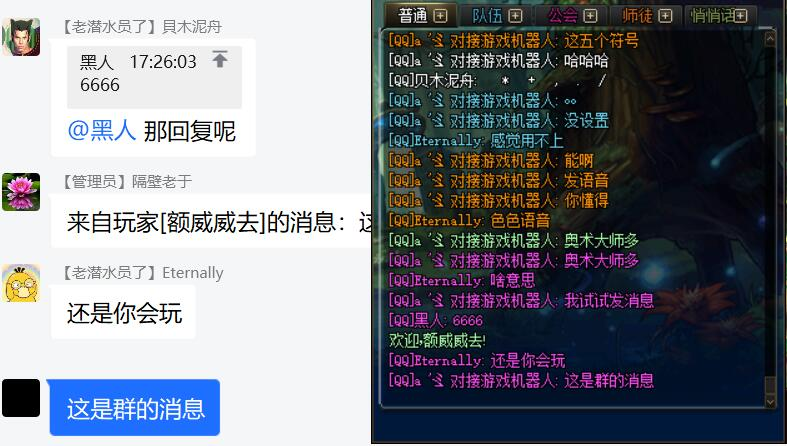
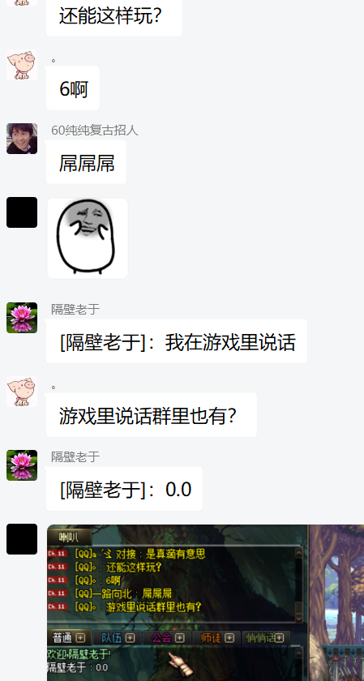

## pro版本功能介绍

### 介绍

* pro版本包部署包调试包售后,不限制使用期限理论上在服务器部署后可永久使用,购买的功能内容以购买时的最新所有内容为准,部分新共嗯那个后续免费更新。
* 以下功能为专业定制开发,对接游戏实现相关特色功能，如果你有新的需求可联系QQ178282627

### 售价
pro基础内容永久授权限时优惠只需100,DLC内容暂无报价,接各种想法和定制功能。

### 命令总览
| 命令             | 示例                | 说明             | 收费策略    |
|:---------------|:------------------|:---------------|:--------|
| `点券猜拳 参数 点券数`  | 点券猜拳 石头 10000     | 使用绑定账号的点券猜拳    | pro基础内容 |
| `点券骰子 大/小 点券数` | 点券骰子 大 10000      | 使用绑定账号的点券猜大小   | pro基础内容 |
| `充值点券 账号 点券数`  | 充值点券 123456 10000 | 为指定游戏账号充值点券    | pro基础内容 |
| `充值点券@用户 点券数`  | 充值点券@张三 10000     | 为指定用户的游戏账号充值点券 | pro基础内容 |
| `开启/关闭掉落播报`    | 开启/关闭掉落播报         | QQ群消息通知掉落      | pro基础内容 |
| `开启/关闭游戏聊天`    | 开启/关闭游戏聊天         | QQ群与游戏互相聊天     | 单独购买DLC |

### 图片展示

#### 1.充值点券

#### 2.Q群与游戏互相聊天

#### 3.掉落播报

